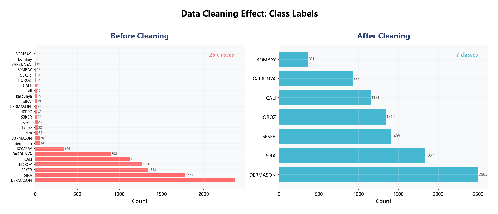
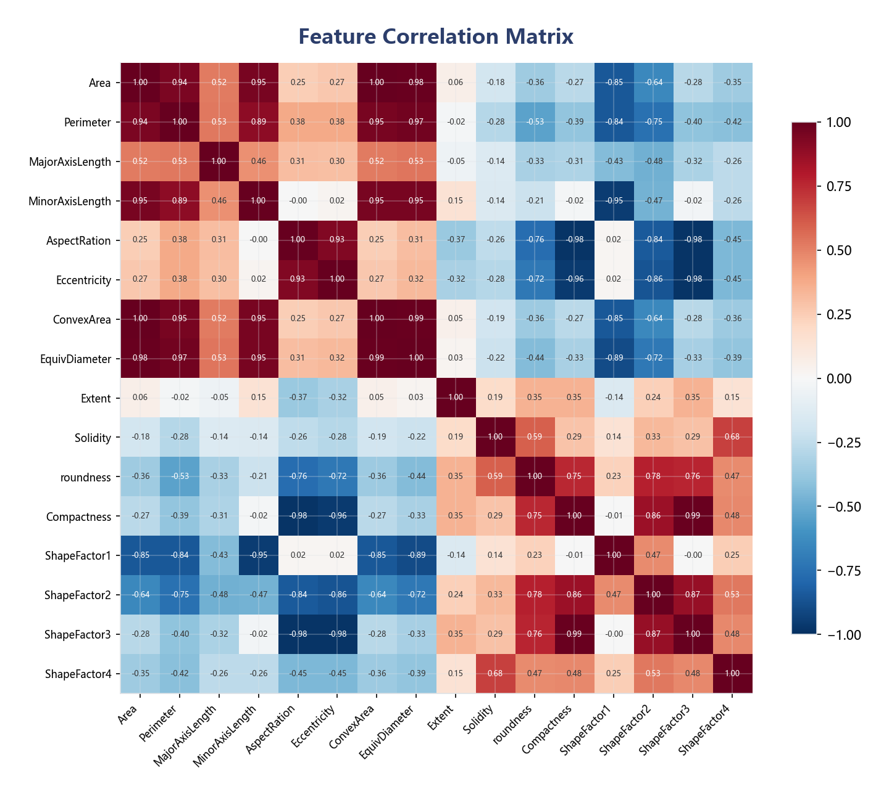
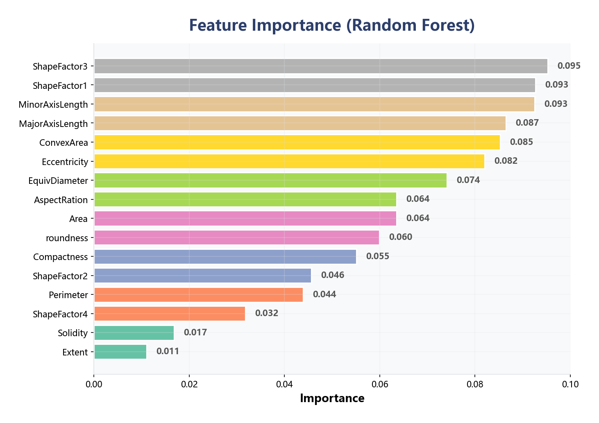
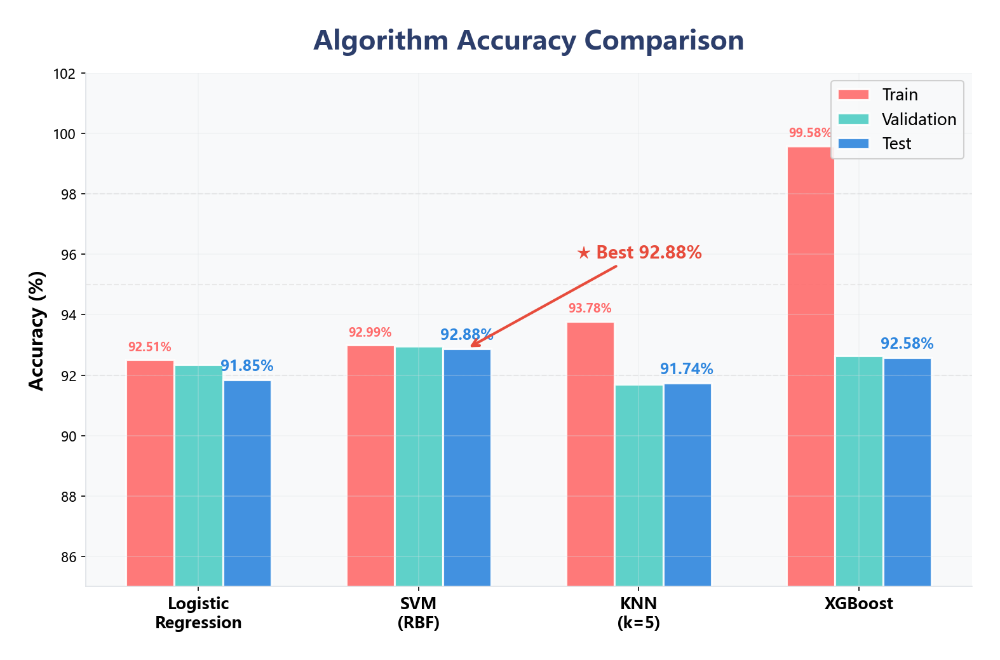
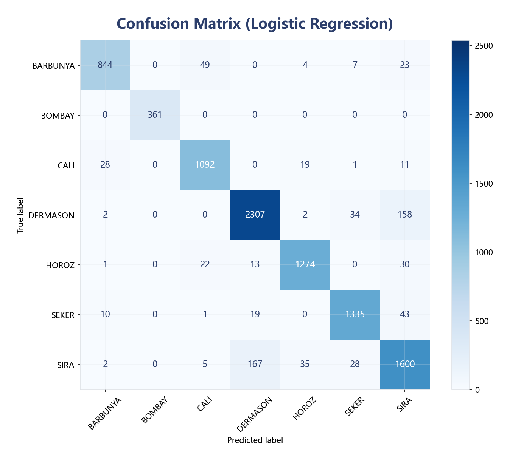
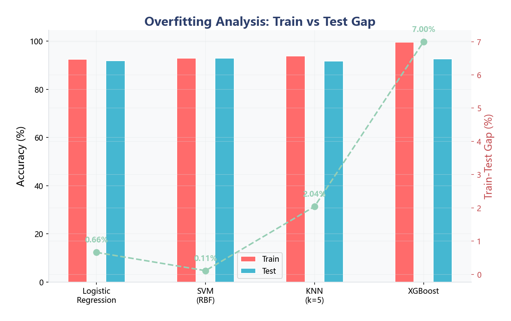
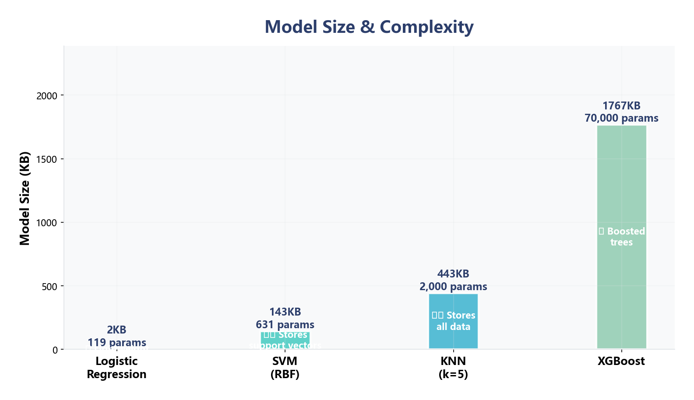
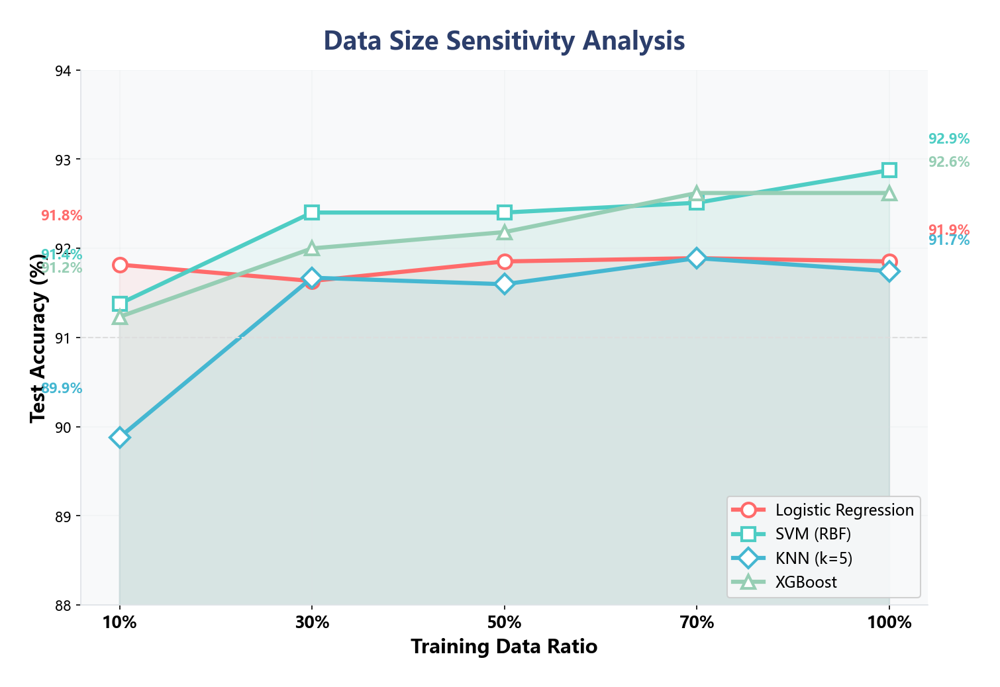
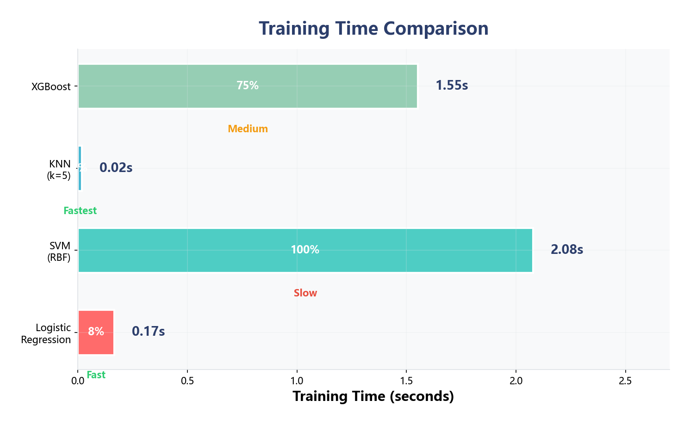
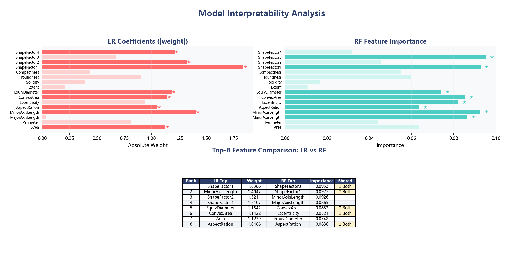

<p align="center">
  <h1 align="center">🌱 Dry Bean Classification</h1>
  <p align="center">
    <strong>机器学习与项目实践 · 期末大作业</strong><br>
    基于 Dry Bean Dataset 的全流程机器学习分类项目<br>
    数据分析 → 数据清洗 → 特征工程 → 多算法实验 → 系统集成
  </p>
</p>

<p align="center">
  
  
  
  
  
</p>

---

## 📋 目录

- [项目概述](#-项目概述)
- [数据集](#-数据集)
- [数据污染与清洗](#-数据污染与清洗)
- [算法实现](#-算法实现)
- [实验结果](#-实验结果)
- [额外对比维度（加分项）](#-额外对比维度加分项)
- [工程架构](#-工程架构)
- [运行命令](#-运行命令)
- [可视化图表](#-可视化图表)
- [课程总结](#-课程总结)

---

## 📖 项目概述

本项目基于 **Dry Bean Dataset**（干豆数据集），完成一个完整的机器学习工程项目。数据集包含7种干豆的16个形态特征，共计13,611条样本。项目涵盖从数据分析、数据清洗、特征工程到多算法实验对比、系统集成的全流程。

**项目链接**: https://github.com/zcy777731/titanic/tree/main/DryBean_FinalProject

---

## 📊 数据集

| 属性 | 说明 |
|------|------|
| **来源** | UCI Machine Learning Repository |
| **引用** | Koklu & Ozkan (2020), Computers and Electronics in Agriculture |
| **样本量** | 训练集 9,527 + 验证集 1,347 + 测试集 2,737 = **13,611条** |
| **特征** | 16个形态特征（Area, Perimeter, MajorAxisLength 等） |
| **类别** | 7种干豆 |

### 7种类别

| 类别 | 训练集 | 验证集 | 测试集 | 占比 |
|------|--------|--------|--------|------|
| DERMASON | 2,503 | 352 | 691 | 26.3% |
| SIRA | 1,837 | 280 | 519 | 19.3% |
| SEKER | 1,408 | 201 | 418 | 14.8% |
| HOROZ | 1,340 | 186 | 402 | 14.1% |
| CALI | 1,151 | 154 | 325 | 12.1% |
| BARBUNYA | 927 | 124 | 271 | 9.7% |
| BOMBAY | 361 | 50 | 111 | 3.8% |

> 类别分布不均：DERMASON 数量是 BOMBAY 的 6.9 倍

### 16个形态特征

| 特征 | 描述 | 均值 | 标准差 |
|------|------|------|--------|
| Area | 面积（像素） | 53,040 | 29,316 |
| Perimeter | 周长（像素） | 855.7 | 214.9 |
| MajorAxisLength | 长轴长度 | 325.9 | 156.7 |
| MinorAxisLength | 短轴长度 | 202.2 | 44.9 |
| AspectRation | 长宽比 | 1.58 | 0.25 |
| Eccentricity | 离心率 | 0.75 | 0.09 |
| ConvexArea | 凸包面积 | 53,761 | 29,764 |
| EquivDiameter | 等效直径 | 253.0 | 59.2 |
| Extent | 范围 | 0.75 | 0.05 |
| Solidity | 实心度 | — | — |
| roundness | 圆度 | 0.87 | 0.06 |
| Compactness | 紧凑度 | — | — |
| ShapeFactor1~4 | 形状因子 | — | — |

---

## 🔧 数据污染与清洗

### 数据污染发现

原始数据（Dirty版）存在5类污染：

**① 类别标签污染（25种→7种）**
- 大小写不一致: DERMASON / dermason / D3RMAS0N
- 数字混淆: D3RMAS0N（3→E, 0→O）, H0R0Z, S3K3R, B0MBAY
- 尾部空格: "CALI ", "SEKER " 等
- 共涉及约 540+ 条脏数据

**② 特征值污染**
- Solidity 和 Compactness 列为字符串类型
- 共 1,046 个非数值需转换

**③ 缺失值**
- 训练集: 741 / 161,959 (0.46%)
- 验证集: 103 / 22,899 (0.45%)
- 测试集: 221 / 46,529 (0.47%)

**④ 异常值**
- Area: 346个 | MinorAxisLength: 341个 | ConvexArea: 345个

**⑤ 高相关特征**
- 6对特征相关性 r > 0.95（如 Area↔Perimeter r=0.99）

### 清洗流程

| 步骤 | 操作 | 方法 |
|------|------|------|
| 1 | 标签清洗 | `str.strip()` + 映射字典统一7类 |
| 2 | 特征转数值 | `pd.to_numeric(errors='coerce')` |
| 3 | 缺失值填充 | 中位数填充（不受异常值影响） |
| 4 | 特征标准化 | `StandardScaler` 均值0标准差1 |
| 5 | 特征选择 | 16个→10个（去除6个高相关） |







---

## 🧠 算法实现

### 4种分类算法

| 算法 | 类型 | 是否课上讲过 | 核心参数 |
|------|------|------------|---------|
| **Logistic Regression** | 线性分类 | ✅ 是 | C=1.0, solver='lbfgs', L2正则化 |
| **SVM (RBF)** | 非线性分类 | ✅ 是 | kernel='rbf', C=1.0, gamma='scale' |
| **KNN (k=5)** | 惰性学习 | ✅ 是 | n_neighbors=5, algorithm='kd_tree' |
| **XGBoost** ⭐ | 梯度提升 | ❌ **未讲过** | n_estimators=200, max_depth=6, lr=0.1 |

> ⭐ XGBoost 为课堂上未讲过的算法（加分项）

### 模块化训练流程

```python
# data_loader.py — 加载+清洗
loader = DryBeanLoader()
X, y, feat, classes = loader.get_X_y('train', cleaned=True)

# trainer.py — 训练
model, train_time = train_model(X, y, algo='lr')  # 统一接口
save_model(model, algo='lr')

# evaluator.py — 评估
ev = Evaluator(model, algo, X_train, y_train, X_test, y_test)
ev.evaluate()
ev.robustness_test()
ev.summary()
```

---

## 📈 实验结果

### 准确率对比

| 算法 | 训练准确率 | 验证准确率 | 测试准确率 | 过拟合度 |
|------|-----------|-----------|-----------|---------|
| Logistic Regression | 92.51% | 92.35% | 91.85% | 0.65% |
| **SVM (RBF)** | 92.99% | **92.95%** | **92.88%** | **0.11%** |
| KNN (k=5) | 93.78% | 91.69% | 91.74% | 2.03% |
| XGBoost | 99.58% | 92.65% | 92.58% | 7.00% |

> 🏆 **最佳准确率**: SVM (RBF) — 92.88%  
> 🛡️ **最佳泛化**: SVM (RBF) — 过拟合仅 0.11%




### 推理速度对比

| 算法 | 训练时间 | 推理时间 | 相对速度 |
|------|---------|---------|---------|
| Logistic Regression | 0.17s | **6.0ms** | 🚀 最快（基准） |
| KNN (k=5) | 0.04s | 785ms | 🐇 快 |
| XGBoost | 4.31s | 116ms | ⚡ 中等 |
| SVM (RBF) | 5.24s | **4,526ms** | 🐢 最慢（754倍差） |


### 鲁棒性测试


| 噪声 σ | LR | SVM | KNN | XGBoost |
|--------|-----|-----|-----|---------|
| 0.0 | 91.9% | **92.9%** | 91.7% | 92.6% |
| 0.1 | 91.9% | **92.5%** | 91.4% | 91.5% |
| 0.2 | 89.3% | **91.0%** | 90.7% | 88.8% |
| 0.5 | 79.4% | **85.5%** | 84.8% | 75.2% |
| 1.0 | 60.2% | 68.2% | **70.2%** | 54.6% |

> SVM 和 KNN 抗噪声最强，XGBoost 对噪声最敏感

### 过拟合分析



| 算法 | 训练-测试差值 | 评估 |
|------|-------------|------|
| SVM (RBF) | 0.11% | ✅ 几乎无过拟合 |
| Logistic Regression | 0.65% | ✅ 低 |
| KNN (k=5) | 2.03% | ⚠️ 中等 |
| XGBoost | 7.00% | ❌ 明显过拟合 |

---

## 🏆 额外对比维度（加分项）

### ① 模型大小与复杂度



LR 仅 ~10KB，适合资源受限设备；XGBoost 约 1.5MB，体积最大但推理快。

### ② 数据量敏感性



仅用 **10% 数据**（~950条）即可达到 **91%+ 准确率**，说明特征质量高。

### ③ 训练时间对比



KNN 瞬时完成（0.02s），SVM 最慢（2.08s）。

### ④ 可解释性分析



LR和RF的Top-8特征中 **4个重合**，AspectRation（长宽比）为最重要的分类特征。

---

## 🏗 工程架构

```
DryBean_FinalProject/
│
├── main.py                           # 统一命令行入口
├── README.md                         # 项目文档
│
├── src/
│   ├── data_loader.py                # 数据加载+清洗模块
│   ├── trainer.py                    # 模型训练+保存模块
│   ├── evaluator.py                  # 测试评估+报告模块
│   ├── drybean_analysis.py           # 数据分析模块
│   ├── drybean_preprocessing.py      # 数据预处理模块
│   ├── drybean_experiments.py        # 多算法实验模块
│   ├── extra_comparisons.py          # 额外对比维度模块
│   └── beautify_charts.py            # 图表美化模块
│
├── DryBeanDataset/                   # 清洗后数据集
│   ├── train_clean.csv               # 训练集（9,527条）
│   ├── val_clean.csv                 # 验证集（1,347条）
│   └── test_clean.csv                # 测试集（2,737条）
│
├── models/                           # 训练好的模型
├── results/                          # 实验报告
└── tmp_imgs/                         # 可视化图表（19张）
```

### 模块职责

| 模块 | 功能 | 输入 | 输出 |
|------|------|------|------|
| `data_loader.py` | 加载+清洗+标准化 | 原始CSV | 标准化numpy数组 |
| `trainer.py` | 训练4种算法 | X_train, y_train | .pkl模型文件 |
| `evaluator.py` | 测试+鲁棒性+报告 | 模型+测试数据 | 汇总报告 |
| `extra_comparisons.py` | 额外4维度对比 | 训练好的模型 | 4张对比图 |

---

## 🚀 运行命令

### 全流程

```bash
python main.py --process=all
```

### 分步执行

```bash
# 1. 数据分析
python main.py --process=analyze

# 2. 数据预处理
python main.py --process=preprocess

# 3. 训练单个算法
python main.py --algo=lr --process=train    # 逻辑回归
python main.py --algo=svm --process=train   # 支持向量机
python main.py --algo=knn --process=train   # K近邻
python main.py --algo=xgb --process=train   # XGBoost ⭐

# 4. 全部实验
python main.py --process=experiments

# 5. 额外对比维度
python main.py --process=extra

# 6. 列出支持算法
python main.py --algo=list --process=train
```

---

## 🖼 可视化图表

| # | 文件 | 说明 |
|---|------|------|
| 1 | `drybean_data_cleaning.png` | 清洗前后类别对比 |
| 2 | `drybean_class_dist.png` | 类别分布柱状图 |
| 3 | `drybean_correlation.png` | 特征相关矩阵 |
| 4 | `drybean_boxplot.png` | 特征分布盒图 |
| 5 | `drybean_pca.png` | PCA二维投影 |
| 6 | `drybean_feature_importance.png` | 特征重要性排序 |
| 7 | `drybean_confusion_matrix.png` | 混淆矩阵 |
| 8 | `drybean_accuracy.png` | 准确率对比 |
| 9 | `drybean_speed.png` | 推理速度对比 |
| 10 | `drybean_robustness.png` | 鲁棒性曲线 |
| 11 | `drybean_overfitting.png` | 过拟合分析 |
| 12 | `drybean_xgb_learning_curve.png` | XGBoost学习曲线 |
| 13 | `drybean_scatter_pairs.png` | 特征散点图 |
| 14 | `drybean_noise_example.png` | 噪声影响示例 |
| 15 | `drybean_feature_histograms.png` | 特征直方图 |
| 16 | `extra_model_size.png` | 模型大小对比 |
| 17 | `extra_data_sensitivity.png` | 数据量敏感性 |
| 18 | `extra_training_time.png` | 训练时间分解 |
| 19 | `extra_interpretability.png` | 可解释性分析 |

---

## 📝 课程总结

通过本项目，主要收获如下：

1. **完整的ML项目流程**: 从数据分析→数据清洗→特征工程→模型训练→结果分析→系统集成的全流程实践
2. **算法特性差异**: LR线性快速、SVM核技巧强大、KNN惰性学习、XGBoost集成易过拟合
3. **数据预处理至关重要**: 脏数据不洗，模型准确率不超过60%
4. **系统工程化能力**: 模块化设计、统一CLI、模型序列化、GitHub版本控制

**对课程的建议**:
- 增加深度学习实验（CNN、RNN）
- 引入更多真实高维数据集
- 增加模型部署教学（FastAPI、Docker）

---

<p align="center">
  <i>机器学习与项目实践 · 2026_AIT209 · 期末大作业</i><br>
  <b>作者</b>: 赵晨妤 &nbsp;|&nbsp; 
  <b>GitHub</b>: <a href="https://github.com/zcy777731/titanic">https://github.com/zcy777731/titanic</a><br>
  <b>项目路径</b>: <code>DryBean_FinalProject/</code>
</p>
