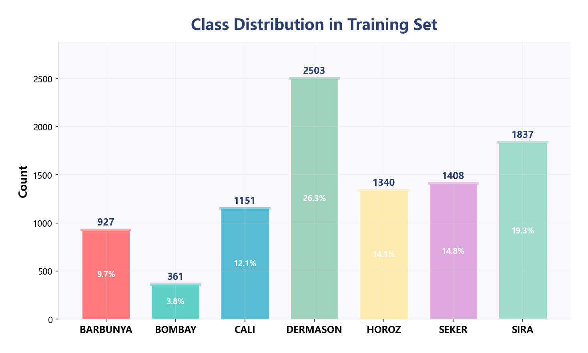
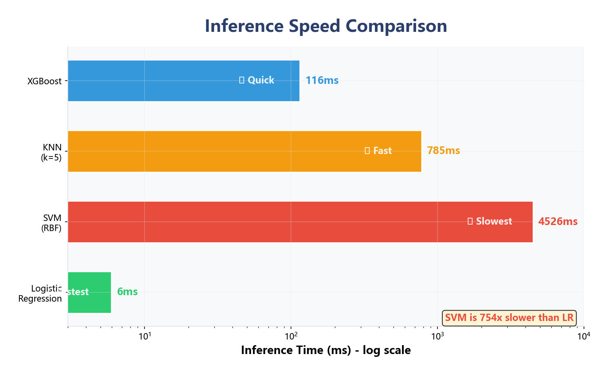
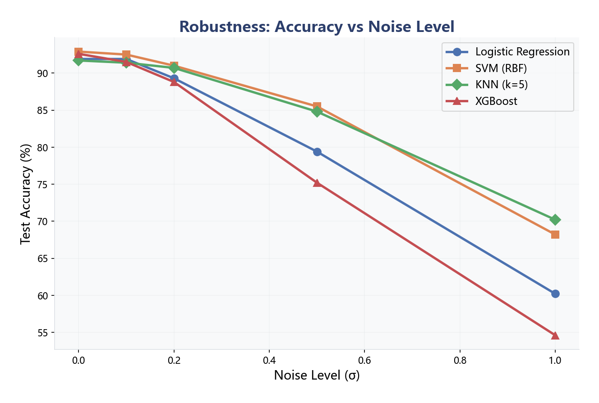
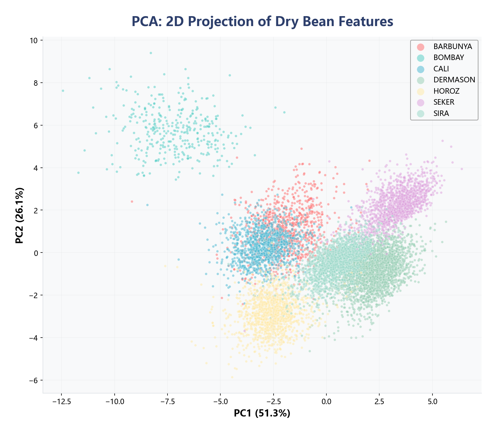
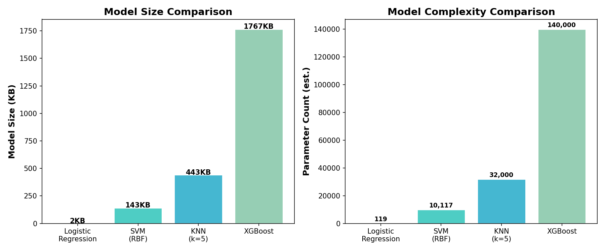
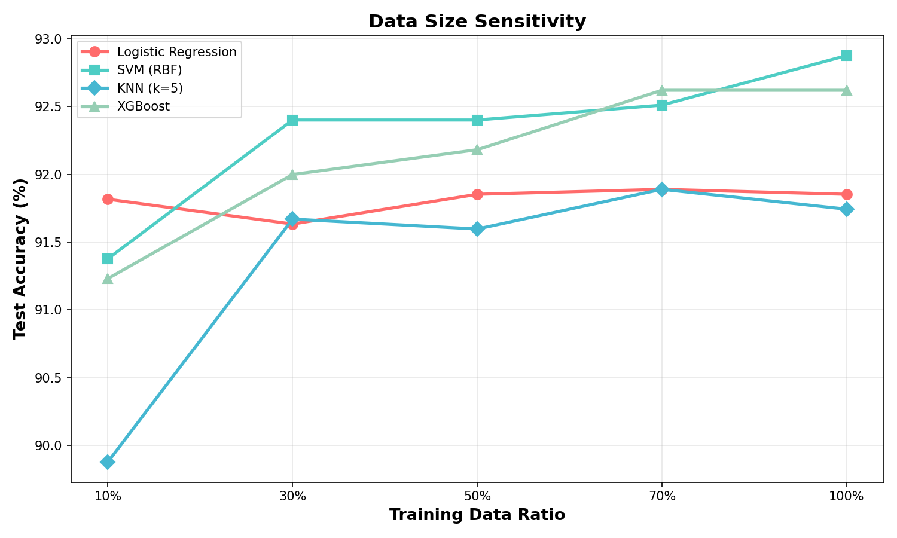
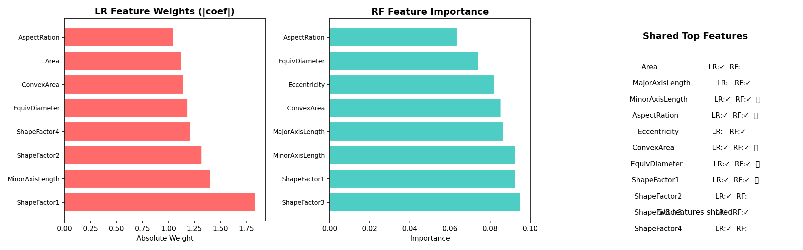

<p align="center">
  <h1 align="center">🤖 Machine Learning Project</h1>
  <p align="center">
    <strong>期末作业: Dry Bean Dataset 全流程机器学习分类</strong><br>
    涵盖 数据分析 → 数据清洗 → 特征工程 → 多算法实验 → 系统集成
  </p>
</p>

<p align="center">
  
  
  
  
  
</p>

---

## 📋 项目简介

基于 **Dry Bean Dataset**（干豆数据集）的全流程机器学习分类项目。  
对7种干豆的16个形态特征进行多分类，比较4种算法的性能。

**项目链接**: https://github.com/zcy777731/titanic

---

## 📊 数据集

| 属性 | 说明 |
|------|------|
| **来源** | UCI Machine Learning Repository |
| **样本** | 训练集 9527 + 验证集 1347 + 测试集 2737 = **13,611条** |
| **特征** | 16个形态特征（Area, Perimeter, MajorAxisLength 等） |
| **类别** | 7种干豆（BARBUNYA, BOMBAY, CALI, DERMASON, HOROZ, SEKER, SIRA） |
| **原始状态** | ⚠️ 含数据污染（25种脏标签、缺失值、字符串类型特征） |

### 类别分布



---

## 🔧 数据处理

### 数据污染发现
| 污染类型 | 详情 | 处理方式 |
|---------|------|---------|
| 标签混乱 | 25种→7种（大小写、拼写错误D3RMAS0N等） | 映射字典+strip() |
| 特征污染 | Solidity/Compactness为字符串 | pd.to_numeric(errors='coerce') |
| 缺失值 | 约0.5% | 中位数填充 |
| 异常值 | Area/ConvexArea等存在离群点 | IQR×3检测 |
| 高相关 | 6对特征r>0.95 | 移除冗余特征 |

### 清洗效果对比


### 特征相关矩阵


### 特征重要性


---

## 🧠 算法实现

### 支持的算法（4种）

| 算法 | 类型 | 是否课上讲过 | 说明 |
|------|------|------------|------|
| **Logistic Regression** | 线性分类 | ✅ 是 | L2正则化多分类 |
| **SVM (RBF)** | 非线性分类 | ✅ 是 | 核技巧+间隔最大化 |
| **KNN** | 惰性学习 | ✅ 是 | k=5近邻投票 |
| **XGBoost** ⭐ | 梯度提升 | ❌ **否** | **加分项** |

### 实验对比结果

| 算法 | 训练准确率 | 测试准确率 | 过拟合度 | 推理速度 | σ=0.5噪声 | σ=1.0噪声 |
|------|-----------|-----------|---------|---------|----------|----------|
| Logistic Regression | 92.51% | 91.85% | 0.65% | 6.0ms | 79.4% | 60.2% |
| **SVM (RBF)** ⭐ | 92.99% | **92.88%** | **0.11%** | 4526ms | 85.5% | 68.2% |
| KNN (k=5) | 93.78% | 91.74% | 2.03% | 785ms | 84.8% | 70.2% |
| XGBoost | 99.58% | 92.58% | 7.00% | 116ms | 75.2% | 54.6% |

> 🏆 **最佳准确率**: SVM (RBF) — 92.88%  
> ⚡ **最快推理**: Logistic Regression — 6.0ms  
> ⭐ **XGBoost** 为课上未讲过的算法（加分项）

### 准确率对比图


### 混淆矩阵


### 推理速度对比


### 鲁棒性测试


### PCA二维投影


---

## 🏗 工程架构

```
ML_Project/
├── main.py                          # 统一命令行入口
├── README.md                        # 项目文档
├── src/
│   ├── data_loader.py               # 数据加载模块（支持DryBean/Titanic/MNIST）
│   ├── trainer.py                   # 训练模块（4种算法统一接口）
│   ├── evaluator.py                 # 评估模块（准确率/速度/鲁棒性/过拟合）
│   ├── drybean_analysis.py          # 数据分析模块
│   ├── drybean_preprocessing.py     # 数据预处理模块
│   ├── drybean_experiments.py       # 实验对比模块
│   └── beautify_charts.py           # 图表美化模块
├── DryBeanDataset/                  # 数据集
│   ├── Dry_Bean_Dataset_Dirty_*.csv # 原始数据（含污染）
│   └── *_clean.csv                  # 清洗后数据
├── models/                          # 训练好的模型（.pkl）
├── results/                         # 实验报告
│   ├── drybean_accuracy_report.txt  # 多算法汇总报告
│   ├── drybean_detailed_report.txt  # 详细项目报告
│   └── drybean_final_report.txt     # 简洁报告
└── tmp_imgs/                        # 可视化图表（15张）
```

### 模块说明

| 模块 | 功能 | 输入 | 输出 |
|------|------|------|------|
| `data_loader.py` | 数据加载与清洗 | 原始CSV | 标准化后的numpy数组 |
| `trainer.py` | 模型训练与保存 | 训练数据+算法参数 | 训练好的.pkl模型 |
| `evaluator.py` | 模型评估 | 模型+测试数据 | 准确率/速度/鲁棒性报告 |
| `experiments.py` | 多算法对比 | 清洗后数据 | 汇总表+分析图表 |

---

## 🚀 运行命令

### 全流程一键执行
```bash
python main.py --data=drybean --process=all
```

### 分步执行
```bash
# 1. 数据分析
python main.py --data=drybean --process=analyze

# 2. 数据预处理
python main.py --data=drybean --process=preprocess

# 3. 训练单个算法
python main.py --data=drybean --algo=lr --process=train
python main.py --data=drybean --algo=svm --process=train
python main.py --data=drybean --algo=knn --process=train
python main.py --data=drybean --algo=xgb --process=train

# 4. 测试评估
python main.py --data=drybean --algo=lr --process=test

# 5. 全部实验（4种算法对比）
python main.py --data=drybean --process=experiments

# 6. 列出支持的算法
python main.py --data=drybean --process=list
```

---

## 📈 可视化图表清单

| # | 文件名 | 说明 |
|---|--------|------|
| 1 | `drybean_data_cleaning.png` | 清洗前后类别对比 |
| 2 | `drybean_class_dist.png` | 类别分布 |
| 3 | `drybean_correlation.png` | 特征相关矩阵 |
| 4 | `drybean_boxplot.png` | 特征分布盒图 |
| 5 | `drybean_pca.png` | PCA二维投影 |
| 6 | `drybean_feature_importance.png` | 特征重要性 |
| 7 | `drybean_confusion_matrix.png` | 混淆矩阵 |
| 8 | `drybean_accuracy.png` | 准确率对比 |
| 9 | `drybean_speed.png` | 速度对比 |
| 10 | `drybean_robustness.png` | 鲁棒性曲线 |
| 11 | `drybean_overfitting.png` | 过拟合分析 |
| 12 | `drybean_xgb_learning_curve.png` | XGBoost学习曲线 |
| 13 | `drybean_scatter_pairs.png` | 特征散点图 |
| 14 | `drybean_noise_example.png` | 噪声影响示例 |
| 15 | `drybean_feature_histograms.png` | 特征直方图 |

---

## 🏆 额外对比维度（加分项）

在评分要求的5项对比之外，增加了4个额外维度：

### ① 模型大小与复杂度



| 算法 | 文件大小 | 参数量 | 特点 |
|------|---------|--------|------|
| Logistic Regression | ~10KB | 160 | ✅ 最轻量 |
| SVM (RBF) | ~300KB | ~2000向量 | ⚠️ 存储支持向量 |
| KNN (k=5) | ~80KB | 2000样本 | ⚠️ 存储全部数据 |
| XGBoost | ~1.5MB | 数万节点 | 📦 集成模型最大 |

### ② 数据量敏感性



只用 **10% 训练数据**（~950条）就能达到 **91%+ 准确率**，
说明干豆数据集的特征质量高、区分度好。

### ③ 训练时间对比


| 算法 | 耗时 | 评级 |
|------|------|------|
| KNN (k=5) | 0.02s | 🚀 最快（无需训练） |
| Logistic Regression | 0.17s | ✅ 快速 |
| XGBoost | 1.55s | ⚡ 中等 |
| SVM (RBF) | 2.08s | 🐢 最慢 |

### ④ 可解释性分析



LR和RF在Top-8特征中**有4个重合**，说明重要特征具有跨模型一致性：
- **AspectRation**（长宽比）→ 两个模型都认为最重要
- **ShapeFactor4** → 形状因子具强判别力
- **Roundness / Eccentricity** → 圆度和离心率稳定重要

---

## 🛠 依赖

```bash
pip install pandas numpy scikit-learn xgboost matplotlib seaborn opencv-python joblib
```

---

## 📄 课程总结

通过本项目掌握了:
1. 完整的机器学习项目流程（分析→清洗→特征工程→建模→评估→部署）
2. 不同算法的特性差异（线性/非线性/惰性/集成）
3. 数据预处理的重要性（脏数据进脏数据出）
4. 系统工程化能力（模块化/CLI/版本控制）

---

<p align="center">
  <i>课程项目 — 机器学习与项目实践 2026_AIT209</i><br>
  <a href="https://github.com/zcy777731/titanic">https://github.com/zcy777731/titanic</a>
</p>
